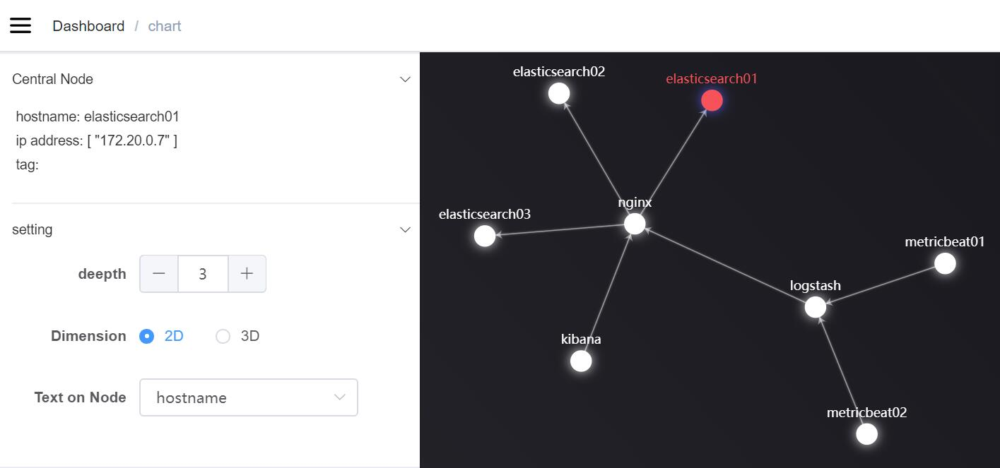

# Vaper
<!-- `docsify serve ./docs -p 3001` -->
> Take a look at the relations among servers.  

[documentation](https://vapering.github.io/vaper/#/)  
[Github](https://github.com/vapering/vaper)  
  
[DEMO](http://vaper.wengpan.top) 
   
<!-- ### [demo](http://vaper.wengpan.top/) -->
  


## Installation
- [docker-compose](en/docker.md)
- [Agent](en/agent.md)

## Development
* [Backend](en/backend.md)
* [Frontend](en/frontend.md)

## Run doc in localhost
```shell
git clone https://github.com/vapering/vaper.git
npm i docsify-cli -g
docsify serve ./docs -p 3001
```

