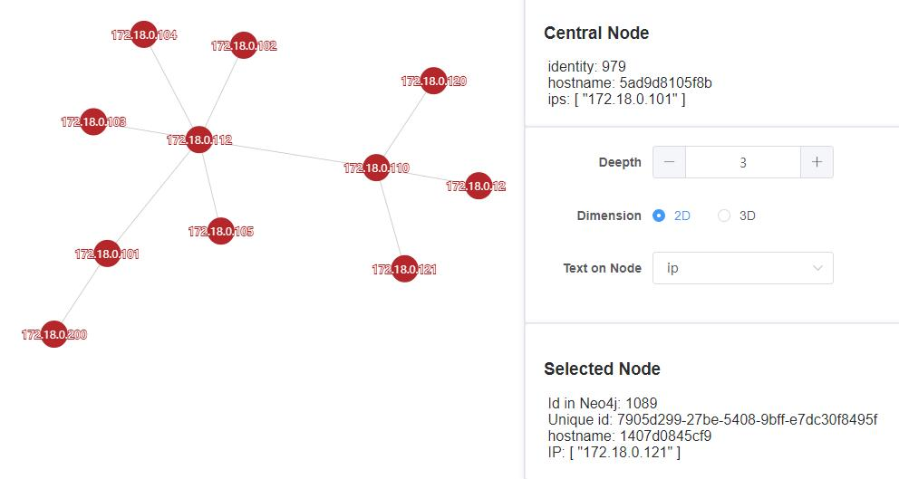

# Vaper
<!-- `docsify serve ./docs -p 3001` -->
> Take a look at the relations among servers.  

### [demo](http://vaper.wengpan.top/)

## Screenshot
**2D Graph (ip)**
  

## Installation
- [docker-compose](en/docker.md)
- [Agent](en/agent.md)

### Development
* [Backend](en/backend.md)
* [Frontend](en/frontend.md)

