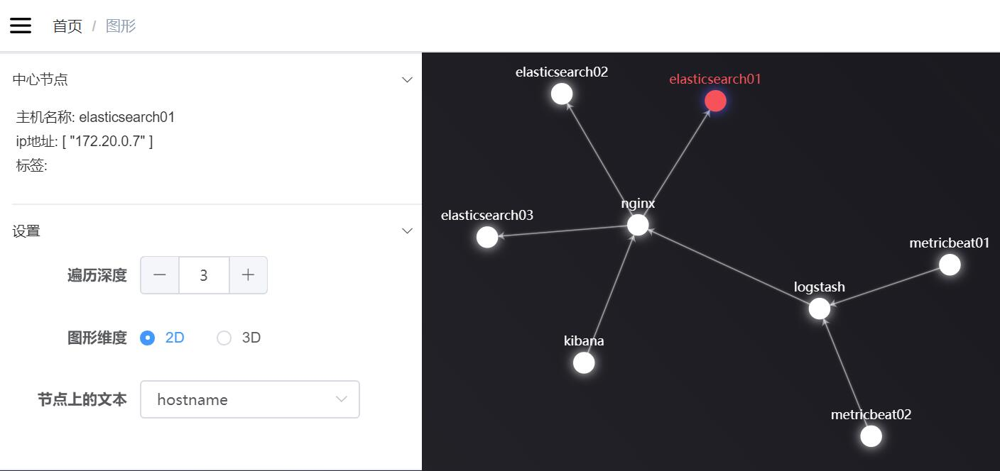

# Vaper
正在翻译中...
> 收集服务器之间的网络流量数据，并实时将拓扑关系可视化展现

[文档](https://vapering.github.io/vaper/#/)  

## 截图
  
## 1分钟部署
## 只运行 vaper-server

```shell
git clone https://github.com/vapering/vaper.git
cd vaper
docker-compose up -d
```
打开 [http://ip:3000](http://vaper-server:3000)  

在操作系统或者容器内运行 vaper-agent 收集数据
```bash
curl -o vaper_agent http://vaper-server:3000/static/agent/vaper_agent
chmod +x ./vaper_agent
nohup ./vaper_agent -a start >>./vaper_agent.log 2>&1 &
```

## 运行一个 vaper-server 和一个 elasticsearch实例服务

```shell
git clone https://github.com/vapering/vaper.git
cd vaper/docker-compose-examples/elasticsearch
docker-compose up -d
```

在所有的容器里面运行 vaper-agent 收集数据  
`sh run_vaper-agent_in_containers.sh`


打开浏览器访问 [http://ip:3000](http://vaper-server:3000)

